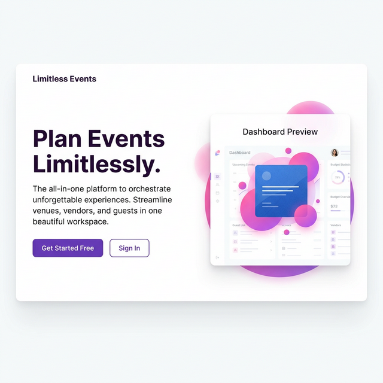

# 🚀 Rajeev Kumar | Personal Portfolio

<div align="center">
  
  
  
  
</div>

---

## 🌟 Overview

Welcome to my professional portfolio website! This project serves as a comprehensive showcase of my journey as a **Full-Stack Developer** and **DSA Enthusiast**. Built with a focus on modern aesthetics, performance, and seamless user experience, it highlights my technical expertise, featured projects, and professional certifications.

🔗 **Live Demo:** [View Live Site](https://rajeev-kumar.netlify.app/) *(Placeholder)*

---

## ✨ Key Features

- **📱 Fully Responsive Design:** Optimized for all screen sizes, from mobile devices to large desktops.
- **🎨 Modern Dark UI:** A premium look featuring glassmorphism, dynamic glows, and animated background blobs.
- **⌨️ Interactive Typing Animation:** Highlights various roles and specializations in the hero section.
- **📜 Reveal on Scroll:** Smooth entry animations for sections and elements using Intersection Observer API.
- **🖼️ Project Flip Cards:** Interactive gallery where cards flip to reveal deep technical details, features, and links.
- **📜 Infinite Certificate Slider:** A custom JS-driven marquee for certifications with touch, drag, and mouse wheel support.
- **📨 Netlify Power Forms:** A production-ready contact form with real-time validation, success animations, and spam protection.
- **📂 Modal Detail System:** Detailed overlays for projects and certificates to provide context without page reloads.
- **📄 Resume Integration:** Direct access to my latest CV for recruiters and collaborators.

---

## 🛠️ Tech Stack

### Frontend & Design
-  
- 
- 
- 

### Icons & Fonts
- **Lucide Icons:** Clean and consistent iconography.
- **Google Fonts:** Utilizing 'Outfit' for headers and 'Inter' for body text.

### Tools & Hosting
- 
- 
- 

---

## 📸 Screenshots

<div align="center">
  
  <p><i>Desktop Preview showing Hero Section and Dynamic Backgrounds</i></p>
</div>

---

## 📂 Project Structure

```bash
portfolio/
├── certificate/        # Images for projects, profile, and certificates
├── index.html          # Main entry point (Structure & Base UI)
├── style.css           # Custom CSS animations and utility overrides
├── script.js           # Core logic, animations, and interactivity
├── success.html        # Redirect page after form submission
└── resume1.pdf         # Professional Resume
```

---

## 🚀 Getting Started

To get a local copy up and running, follow these simple steps:

1. **Clone the repository**
   ```bash
   git clone https://github.com/Rajeev416/portfolio.git
   ```
2. **Navigate to the directory**
   ```bash
   cd portfolio
   ```
3. **Open the project**
   - Simply open `index.html` in your favorite browser.
   - Or use VS Code **Live Server** for the best development experience.

---

## 📈 Optimization & Performance

- **Lightweight Assets:** Optimized images and PDF files for fast loading.
- **CDN Integration:** Tailwind and Lucide are loaded via high-availability CDNs.
- **Vanilla JS:** No heavy frameworks used, ensuring a fast First Contentful Paint (FCP).

---

## 🤝 Connect with Me

I'm always open to discussing new projects, creative ideas, or opportunities to be part of your vision.

- **Email:** [rajeevkumar98400@gmail.com](mailto:rajeevkumar98400@gmail.com)
- **LinkedIn:** [linkedin.com/in/rajeev-kumar2004](https://linkedin.com/in/rajeev-kumar2004)
- **GitHub:** [@Rajeev416](https://github.com/Rajeev416)

---

## 📝 License

Distributed under the **MIT License**. See `LICENSE` for more information.

<div align="center">
  Made with 💜 by Rajeev Kumar
</div>
